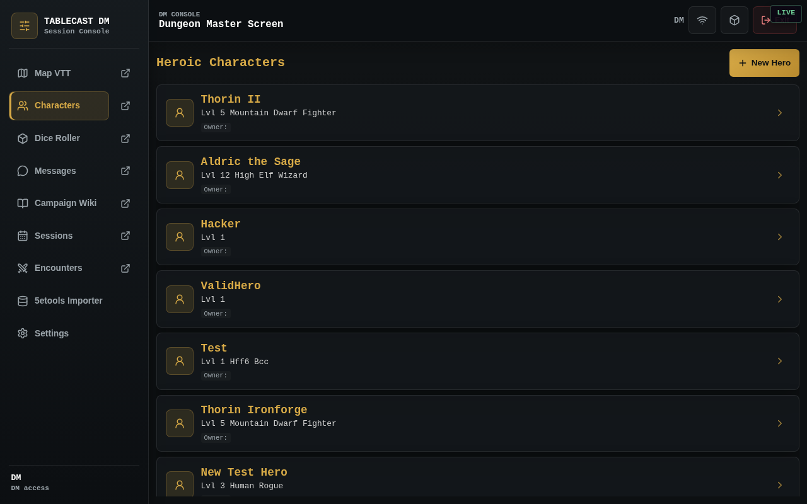
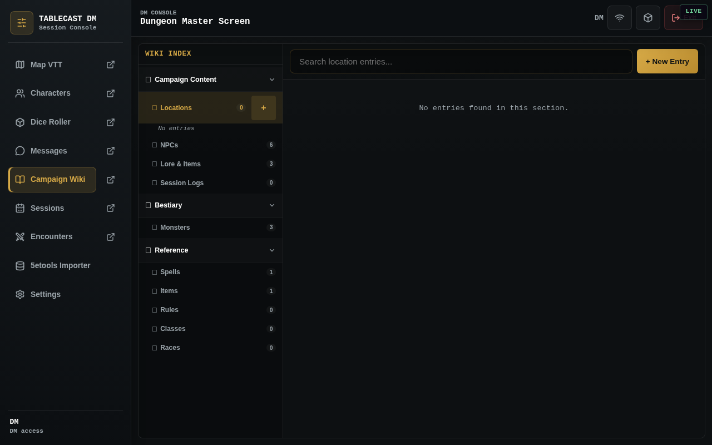
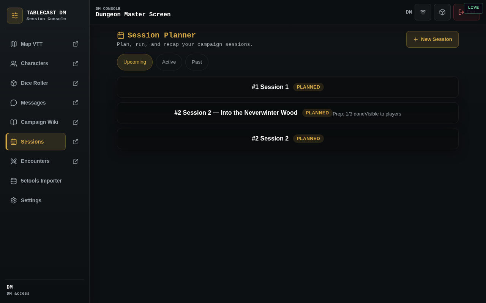

# Tablecast 🎲

> **A LAN-based D&D 5e Virtual Tabletop Companion** — battle maps, dice rolling, character sheets, campaign wiki, AI assistant, and combat tracking, all designed for the DM's home Wi-Fi.


*The Tablecast Tavern — choose your hero or enter as DM*

---

## ✨ Features

### 🗺️ Virtual Tabletop (VTT)

Full-featured battle map with grid-based movement, token placement, fog of war, dynamic line-of-sight, measurement ruler, and real-time sync across all players' devices.


*The Tactician's Grid — battle map with canvas rendering, tokens, and DM toolbar*

### 🎲 3D Dice Rolling

Physics-based 3D dice with multiple themes (default, glass, gold, ice, magma, obsidian, stone, wood). Roll with a click and watch the dice tumble in real-time.


*3D dice roller with customizable themes and colors*

### 🧙 Character Sheets

Full D&D 5e character sheets with ability scores, skills, attacks, spells, inventory, and auto-calculated modifiers. Create and manage multiple characters.


*Character sheet with ability scores, skills, and combat stats*

### 💬 Chat & Communication

Real-time chat with message history, typing indicators, dice roll integration, and AI-powered responses. Chat messages are synced live to all connected clients.


*Live chat panel with message history and dice roll integration*

### 📖 Campaign Wiki

DM-managed wiki with categories (LORE, NPC, LOCATION, FACTION, LOG, QUEST). Create, edit, and organize campaign knowledge. Toggle visibility for players.


*Campaign wiki with tree navigation and article editing*

### 📅 Game Sessions

Plan and track game sessions with agenda, recaps, and preparation checklists. Keep your campaign organized session-by-session.


*Session planning with agenda, recap, and prep checklist*

### ⚔️ Combat Encounters

Full encounter management with initiative tracking, HP/AC monitoring, conditions, death saves, and turn-based combat flow. Add NPCs, monsters, and player characters as participants.


*Encounter tracker with initiative, HP, conditions, and turn management*

### 🤖 AI Assistant

Built-in AI assistant for rules questions, NPC generation, encounter building, and roleplay. Supports multiple AI providers (OpenAI-compatible + Ollama) with streaming responses.

### 📚 5e SRD Reference

Built-in search across the full D&D 5e SRD — spells, monsters, magic items, classes, feats, and more. Data is cached locally from the 5etools mirror.

---

## 🏗️ Architecture

```
┌──────────────────────────────────────────────────────┐
│ DM's Computer (Docker Container)                      │
│  ┌────────────┐     ┌──────────────────────────────┐ │
│  │ Express API │────▶│ Prisma + SQLite              │ │
│  │ Socket.io   │◀───▶│ MCP Server                   │ │
│  │ Static SPA  │     │ AI Provider (Ollama/API)     │ │
│  └────────────┘     └──────────────────────────────┘ │
│                                                       │
│ Players connect over LAN via http://192.168.0.77:3001 │
└──────────────────────────────────────────────────────┘
```

---

## 🛠️ Technology Stack

| Layer | Technology |
|---|---|
| **Frontend** | React 18, Vite 5, React Router 6, Lucide React |
| **3D Dice** | `@3d-dice/dice-box` (BabylonJS-based) |
| **VTT Canvas** | HTML5 Canvas API with custom render loop |
| **Backend** | Node.js 22, Express 4, Socket.io 4 |
| **ORM** | Prisma 5 (SQLite provider) |
| **AI** | OpenAI-compatible API + Ollama |
| **Backup** | `archiver` (zip) + `rclone` (Google Drive) |
| **Container** | Docker multi-stage build (node:22-slim) |
| **PWA** | Service worker, manifest, offline support |

---

## 📦 Project Structure

```
tablecast/
├── client/                    # React frontend (Vite)
│   ├── src/
│   │   ├── components/        # UI components (Chat, Map, Dice, Wiki, etc.)
│   │   ├── context/           # Socket, DiceBox, AI contexts
│   │   ├── hooks/             # Custom React hooks
│   │   ├── utils/             # Utilities (aiStream, dynamicLighting)
│   │   └── App.jsx            # Root component
│   └── public/                # Static assets, dice-box themes
├── server/                    # Express + Socket.io backend
│   ├── src/
│   │   ├── routes/            # 16 API route modules
│   │   ├── ai/                # AI subsystem (chat, generation, helpers)
│   │   ├── mcp/               # MCP tool handlers
│   │   ├── utils/             # Logger, backup, reference sync/search
│   │   ├── socket.js          # Socket.io event handlers
│   │   ├── index.js           # Express entry point
│   │   ├── auth.js            # Header-based auth
│   │   └── mcp-server.js      # MCP server
│   └── prisma/
│       ├── schema.prisma      # 17 models
│       └── seed.js            # Database seed
├── Dockerfile                 # Multi-stage Docker build
├── docker-compose.yml         # Container orchestration
└── opencode.json              # AI agent configuration
```

---

## 🚀 Quick Start

### Prerequisites
- Node.js 22+
- Docker & Docker Compose (for production deployment)

### Local Development

```bash
# Install server dependencies
cd server && npm install

# Generate Prisma client and run migrations
npx prisma generate
npx prisma migrate dev

# Seed the database
npm run db:seed

# Start the development server
npm run dev
```

```bash
# In another terminal — install client dependencies
cd client && npm install

# Start the Vite dev server
npm run dev
```

### Production Deployment (Docker)

```bash
# Build and run with Docker Compose
docker compose -p tablecast up -d --build
```

The server binds to `0.0.0.0:3001` for LAN access. Players connect via `http://<DM_IP>:3001` on their phones or tablets.

> **🔐 Default DM Password:** `dm1234`  
> Enter this on the Tavern landing screen to access the DM dashboard.

---

## 🔌 API Routes

| Method | Path | Purpose |
|--------|------|---------|
| GET/POST | `/api/users` | Player/DM user management |
| CRUD | `/api/characters` | D&D 5e character sheets |
| CRUD | `/api/npcs` | NPC statblocks |
| CRUD | `/api/monsters` | Monster bestiary |
| CRUD | `/api/wiki` | Campaign wiki articles |
| CRUD | `/api/maps` | VTT map images |
| CRUD | `/api/encounters` | Combat encounters |
| CRUD | `/api/sessions` | Game session planning |
| POST | `/api/backup` | Trigger backup to Google Drive |
| GET | `/api/reference` | 5e SRD reference search |
| GET/POST | `/api/ai` | AI queries and generation |
| POST | `/api/rolls` | Dice roll history |
| GET/POST | `/api/chat` | Chat message history |
| GET | `/api/debug` | Server health, MCP logs, AI logs |

---

## 🔐 Security

Tablecast runs on a **trusted LAN only**. Key design decisions:
- **No TLS/HTTPS** — plain HTTP on the local network
- **No CSRF protection** — header-based auth (`x-tablecast-user-id`)
- **Rate limiting** — 200 req/min per IP
- **User-ID auth** is not cryptographic — any LAN client can impersonate any user
- **Default DM password:** `dm1234` — change it in Settings after first login

---

## 🔄 Deployment

Code changes are deployed via git push → GitHub webhook:

```
http://192.168.0.77:3000/api/git/stacks/2/webhook
```

This triggers a remote `docker compose` rebuild on the server.

---

## 📋 Prisma Models (17)

- **User** — Players and DMs with dice theme preferences
- **Character** — D&D 5e character sheets with abilities, inventory, spells
- **Npc** — DM-created NPC statblocks
- **Monster** — Imported monsters from 5e SRD
- **Map** — VTT maps with grid, fog state, and walls data
- **Token** — Map tokens linked to characters/NPCs/monsters
- **WikiArticle** — Campaign wiki articles by category
- **Encounter** — Combat encounters with participants
- **EncounterParticipant** — Initiative, HP, conditions, death saves
- **ChatMessage** — Chat history with dice roll details
- **GameSession** — Session planning with agenda and recaps
- **Roll** — Dice roll history with results
- **AiConversation / AiMessage** — AI chat conversations
- **AppSetting** — Key-value configuration store
- **McpLog** — MCP tool call audit trail
- **AiResponseLog** — AI API call audit trail

---

## 🤖 AI Integration

Tablecast features a multi-provider AI subsystem:
- **Rules Scholar** — Ask D&D 5e rules questions with RAG from SRD reference
- **NPC Generator** — Generate NPCs with stats, personality, and backstory
- **Encounter Builder** — Build balanced combat encounters
- **NPC Roleplay** — Chat with NPCs as their character
- **Streaming** — Real-time streaming AI responses via Server-Sent Events

Configure via Settings → AI Setup (OpenAI API key or Ollama endpoint).

---

## 📸 Screenshots

| Panel | Description |
|-------|-------------|
|  | **Tavern Landing** — Hero selection screen |
|  | **VTT Battle Map** — Tactician's Grid with tokens |
|  | **Character Sheet** — D&D 5e stats and abilities |
|  | **3D Dice Roller** — Physics-based rolling |
|  | **Chat** — Live messaging and dice rolls |
|  | **Campaign Wiki** — Lore, NPCs, locations |
|  | **Game Sessions** — Agenda and recaps |
|  | **Combat Tracker** — Encounter management |

---

## 📄 License

Tablecast is designed for personal use on trusted local networks. All D&D 5e reference data is sourced from the [5etools mirror](https://github.com/5etools-mirror-3/5etools-src) under the OGL and Fan Content Policy.
